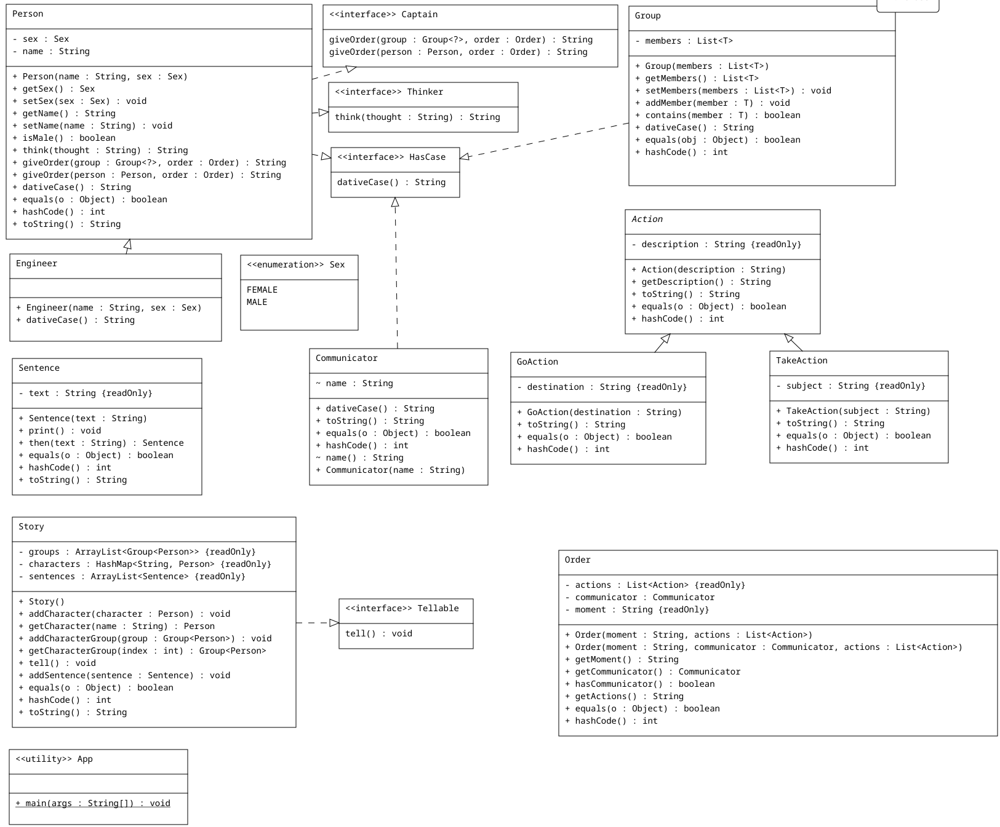

# Лабораторная работа №3

**Описание предметной области, по которой должна быть построена объектная модель:**

    "Если они и отправились куда-нибудь, то, безусловно, пошли по этой дорожке", -- подумал Знайка. Придя к такому умозаключению, он тотчас отдал по радиотелефону приказ Кубику, Тюбику, Звездочкину, Стекляшкину и инженеру Клепке взять с собой приспособления для лазания по горам и отправляться вслед за ним к пирамидальной горе.

**Программа должна удовлетворять следующим требованиям:**

1. Доработанная модель должна соответствовать принципам SOLID.
2. Программа должна содержать как минимум два интерфейса и один абстрактный класс (номенклатура должна быть согласована с преподавателем).
3. В разработанных классах должны быть переопределены методы equals(), toString() и hashCode().
4. Программа должна содержать как минимум один перечисляемый тип (enum).

**Порядок выполнения работы:**

1. Доработать объектную модель приложения.
2. Перерисовать диаграмму классов в соответствии с внесёнными в модель изменениями.
3. Согласовать с преподавателем изменения, внесённые в модель.
4. Модифицировать программу в соответствии с внесёнными в модель изменениями

**UML-диаграмма**

