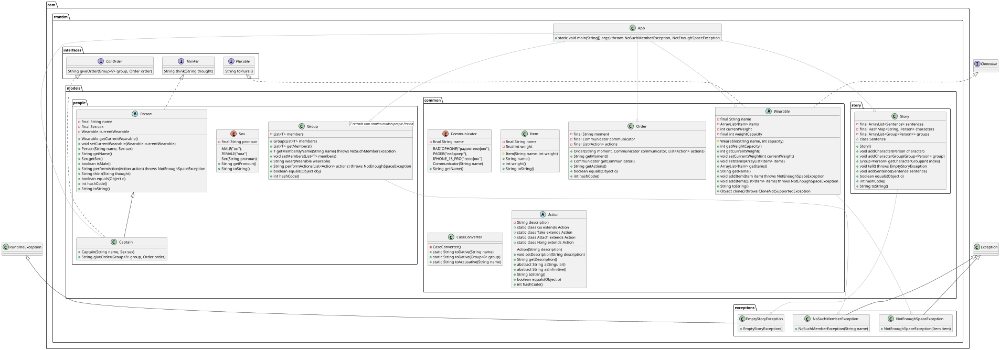

# Лабораторная работа №4

**Описание предметной области, по которой должна быть построена объектная модель:**

> "Если они и отправились куда-нибудь, то, безусловно, пошли по этой дорожке", -- подумал Знайка.
> Придя к такому умозаключению, он тотчас отдал по радиотелефону приказ Кубику, Тюбику, Звездочкину,
> Стекляшкину и инженеру Клепке взять с собой приспособления для лазания по горам и отправляться вслед за ним
> к пирамидальной горе. Кубик, Тюбик, Звездочкин, Стекляшкин и Клёпка мигом надели скафандры. Каждый взял альпеншток,
> прицепил к поясу ледоруб и моток прочного капронового шнура, а Стекляшкин подвесил на спину свой телескоп,
> с которым обычно не расставался.

**Программа должна удовлетворять следующим требованиям:**

1. В программе должны быть реализованы 2 собственных класса исключений (checked и unchecked), а также обработка исключений этих классов.
2. В программу необходимо добавить использование локальных, анонимных и вложенных классов (static и non-static).

**Порядок выполнения работы:**

1. Доработать объектную модель приложения.
2. Перерисовать диаграмму классов в соответствии с внесёнными в модель изменениями.
3. Согласовать с преподавателем изменения, внесённые в модель.
4. Модифицировать программу в соответствии с внесёнными в модель изменениями

## Детали реализации

Начинается всё с класса `Story`, который по сути своей является контейнером для персонажей (подклассов `Person`),
их групп (класс `Group`) и предложений (вложенный класс `Sentence` класса `Story`).

Единственный абстрактный класс в данной программе - `Person`, предназначенный для работы с персонажами. У него есть 2 подкласса:

1. `Captain`, реализующий интерфейс `CanOrder`
2. `Shorty` - локальный класс метода `main`, созданный для того, чтобы была возможность
создавать объекты абстрактного `Person`. Используется для героев, не имеющих особенностей.

В программе присутствуют 3 интерфейса:

1. `CanOrder` с методом `giveOrder` для того, чтобы отдавать приказ группе персонажей.
2. `Thinker` с методом `think` для выделения мыслей персонажей.
3. `Wearable` с методами `singular` и `plural`, возвращающими название предмета в множественном и единственном числе.
(Честно создан для галочки, только чтобы был анонимный класс в `main`)

Оба исключения, реализованных в работе относятся к классу `Story`. `EmptyStoryException` не даёт запустить пустую историю
(иначе какой в ней смысл?), а `NoSuchMemberException` по сути является аналогом `IndexOutOfBoundsException`
(ведь `Story` это контейнер).

## Диаграмма классов

