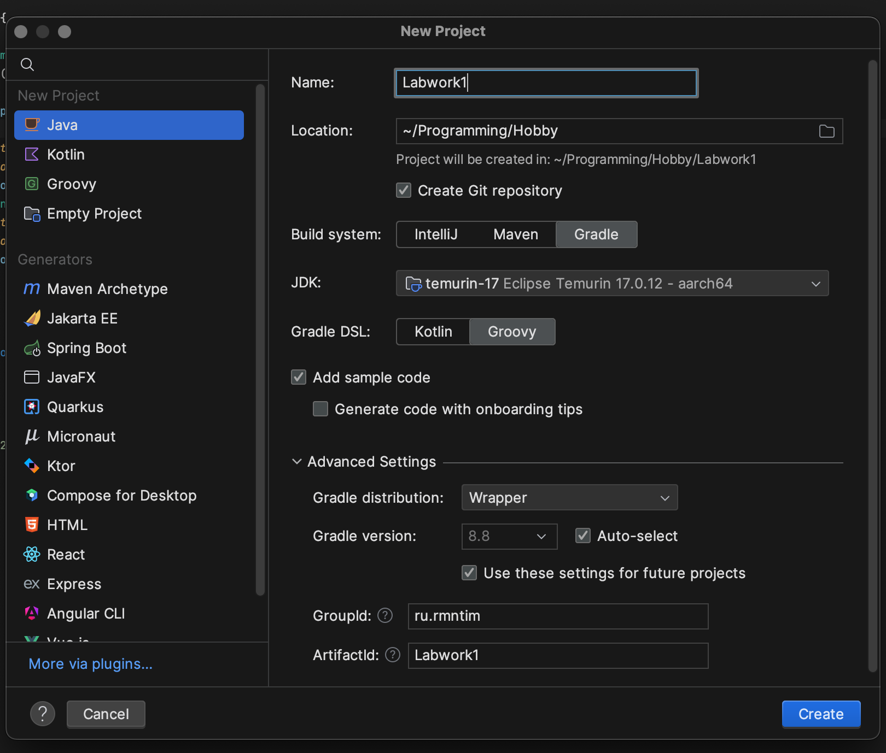

# Гайд по 1 лабораторной работе для самых ~~тупых~~ маленьких

> [!IMPORTANT]
> Кто не поставил звездочку репозиторию тот БЭВМ

> [!NOTE]
> Делать все будем в Intellij IDEA Ultimate, остальным соболезную.

## Создание проекта

Создаем Java проект с Gradle на билд системе (Groovy DSL потому что дитенаху).



Создаем в корне проекта папку `libs/` и кладем в нее нашу библиотеку скачаную
с [se.ifmo.ru](https://se.ifmo.ru/documents/10180/11512/fastcgi-lib.jar/7493e31c-ee90-6e5b-f315-d8468347755e).
Открываем `build.gradle` и добавляем в него следующее:

```groovy
dependencies {
    implementation files('./libs/<НАЗВАНИЕ БИБЛИОТЕКИ>.jar') // Указываем путь к библиотеке
}
// Этот блок нужен для сборки fat jar файла
jar {
    manifest {
        attributes(
                'Main-Class': 'ru.rmntim.web.Main'
        )
    }
    from {
        configurations.runtimeClasspath.collect { it.isDirectory() ? it : zipTree(it) }
    }
    archiveFileName = 'labwork1.jar'
}
```

Теперь наш прекрасный проект собирается одной командой:

```bash
./gradlew jar
```

Собранный jar-файл лежит в `build/libs/labwork1.jar`. Я надеюсь запускать jar файлы вы умеете (если нет пишите ПСЖ вас
не спасти).

## Локальный запуск (через Docker)

Итак самое веселое. Так как (если вы не долбоеб) вы хотите тестить полученное приложение на локальной машине, вы должны
сначала создать докер-контейнер с помощью docker compose. Для этого нам нужны 2 вещи:

- `Dockerfile` для нашего приложения
- `docker-compose.yml` для связки httpd с нашим приложением

### Dockerfile

```dockerfile
# Собираем наш сервер
FROM gradle:8.10-jdk17 AS build
COPY --chown=gradle:gradle .. /home/gradle/src
WORKDIR /home/gradle/src
RUN gradle jar --no-daemon

FROM eclipse-temurin:17-jre
# Этот порт значения не имеет, выбираем любой
EXPOSE 1337
RUN mkdir /app
WORKDIR /app
COPY --from=build /home/gradle/src/build/libs/*.jar /app/app.jar
ENTRYPOINT ["java", "-DFCGI_PORT=1337", "-jar", "app.jar"]
```

### docker-compose.yml

```yaml
services:
  # Наше приложение
  fcgi:
    build:
      context: .
      dockerfile: Dockerfile
    networks:
      backend:

  # Сам веб-сервер
  httpd:
    image: "httpd:2.4.62"
    ports:
      - "8080:80"
    volumes:
      - "./httpd.conf:/usr/local/apache2/conf/httpd.conf"
      - "./static:/var/www"
    networks:
      backend:
networks:
  backend:
```

Из содержания `docker-compose.yml` мы видим что нужно создать 2 файла (ну 1 файл и директорию, не доебывайтесь до слов):

- `httpd.conf` - настройки веб-сервера
- `static/` - статические файлы (HTML + CSS + JS)

Вся соль в том, что `httpd.conf` нам нужен особенный, тот что лежит на se.ifmo.ru подходит только для гелиоса. В этой
папке лежит уже готовый так что вам даже ничего делать не надо.

## Написание самого сервера

Это я оставлю на вас, так как тут сильная зависимость от лабы.
Могу разве что дать ссылку на документацию этой библиотеки: https://fastcgi-archives.github.io/fcgi2/doc/fcgi-java.htm

## Запуск

> [!WARNING]
> Помним, что в `httpd.conf` для нашего сервера указан адрес `/calculate`. Порт проброшен 8080.

По сути все делается 1 командой:

```bash
docker compose up -d
```

Если хотите обновить приложение в контейнере:

```bash
docker compose up --build -d
```

После выполнения этой команды (если вы все правильно сделали) у вас поднимаются 2 контейнера и становиться доступен порт
8080, через который вы как раз сможете взаимодействовать с приложением.

## Запуск на гелиосе

И так тут уже легкая часть. Вам нужно просто собрать jar файл командой, которую я писал [выше](#создание-проекта), и
перекинуть его на гелиос. Тут же я оставлю файлик `httpd-helios.conf` в котором все **почти готово**. Нужны только пара
изменений, описанных в самом файле.

Чтобы попасть с локального компа на сайт нужно пробросить порты на гелиос:

```bash
ssh -L <ВЫДАННЫЙ ВАМ ПОРТ>:localhost:<ВЫДАННЫЙ ВАМ ПОРТ> s<ВАШ ИСУ>@helios.cs.ifmo.ru -p 2222
```

Там нужно соорудить такую вот структуру папок:

```
~/
  httpd-root/
    conf/
      httpd.conf # тот самый httpd-helios.conf
    fcgi-bin/
      app.jar
    mutex-dir/ # оставить пустой
    
  .www/
    # Здесь будут ваши html,css,js файлы
```

После этого мы производим запуск httpd сервера:

```bash
httpd -f ~/httpd-root/conf/httpd.conf -k start
```

И java сервера:

```bash
java -jar -DFCGI_PORT=<СЛУЧАЙНЫЙ ПОРТ ИЗ httpd.conf> ~/httpd-root/fcgi-bin/app.jar
```

Открываем в браузере `http://localhost:<ВАШ ПОРТ>/` и все. Вы ~~не совсем еблан~~ великолепны!
